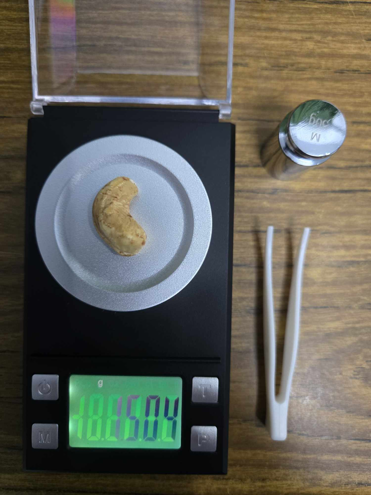
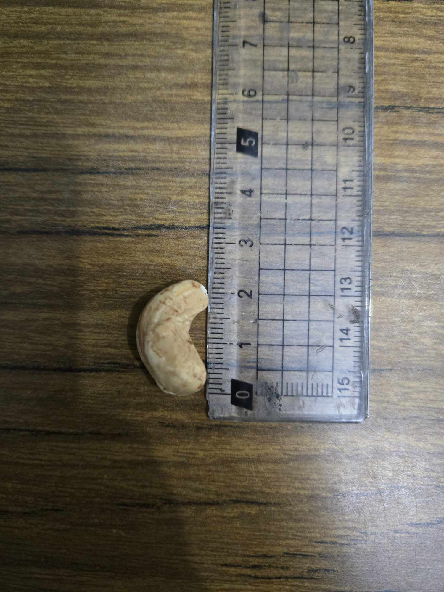
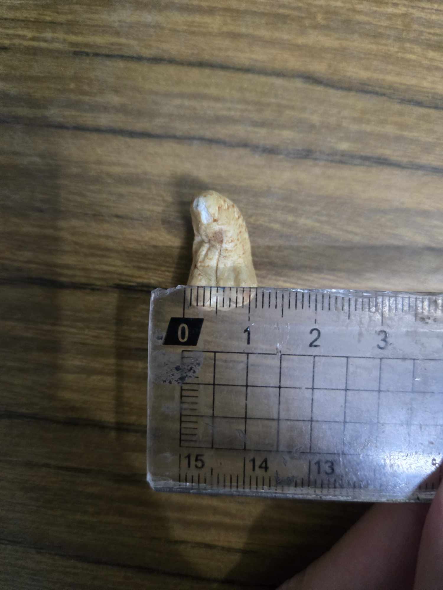

# Cashew Classification - Undergraduate AI Capstone HW1

## Introduction
This project aims to classify different brands of cashews using **Machine Learning** techniques.  
The dataset consists of cashew measurements (width, length, and weight), and we apply **supervised & unsupervised learning** to classify the cashew brands.

---

## Dataset Description
The dataset (`cashew.xlsx`) contains measurements of cashews from 3 different brands, each with 100 samples.  
The dataset consists of 300 samples in total, with no missing values in either samples or features.  
Each sample has **three numerical features**:

|    Feature   |        Description       | Data Format |
|--------------|--------------------------|-------------|
| `width(mm)`  | Width of the cashew nut  |    float    |
| `height(mm)` | Height of the cashew nut |    float    |
| `weight(mg)` | Weight of the cashew nut |    float    |

The dataset also contains a **target label (`type`)**, indicating the brand of the cashew:

- **Type 1**: 大潤發
- **Type 2**: 盛香珍
- **Type 3**: 臻品行

---

## Data Source 
The cashews of brand 大潤發 and of brand 盛香珍 are bought from 大潤發 with two bags of each brand (150g each bag, and the expiration dates of the same brand are the same).  
The cashews of brand 臻品行 is bought from Shopee with one bag only (300g each bag).  
All of the data here is measured by the owner personally.

---

## Measurement Description
The **weight** of cashews is measured using a **professional digital jewelry scale (8028-series)**.  
- Precision: **50g / 0.001g**
- Example:

  
The **height and width** of cashews are measured using a **standard metric ruler**.  
- **Height**: Measured along the symmetry axis of the cashew.  
- **Width**: Measured at the widest horizontal length perpendicular to the symmetry axis.  
- Example:

